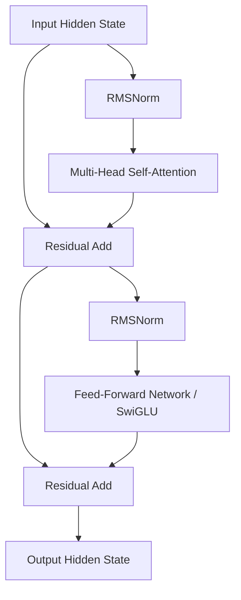

# Autoregressive LLM Base Pre-Training Pipelines

In the pre-training of Large Language Models (LLMs), training stability and execution speed are paramount. RMSNorm has become the default normalization choice in modern autoregressive LLM architectures (such as Llama 3, Mistral, and Gemma) because it addresses these two needs simultaneously.

---

## 1. Role in Pre-Training

Autoregressive language modeling involves predicting the next token in a sequence. During pre-training:
*   **Trillions of Tokens:** Models are trained on massive clusters for months. Even a $10\%$ execution speedup translates to millions of dollars in saved compute costs.
*   **Stabilization:** Normalization prevents the gradients from exploding or vanishing across deep layers, maintaining steady convergence throughout the pre-training run.

RMSNorm's scale-only formula achieves convergence behavior equivalent to standard LayerNorm while executing significantly faster on GPU hardware.

---

## 2. Transformer Layer Integration

In modern decoder-only Transformers, RMSNorm is applied as a Pre-Norm before both the Self-Attention and Feed-Forward Network (FFN) blocks:

---

## 3. Real-world Adopted Architectures
*   **Llama 3 (Meta):** Uses RMSNorm with a hidden dimension of up to $8192$.
*   **Mistral 7B (Mistral AI):** Employs RMSNorm to achieve high throughput.
*   **Gemma (Google):** Employs RMSNorm as the baseline layer.

---

[← Back to README](../README.md)
