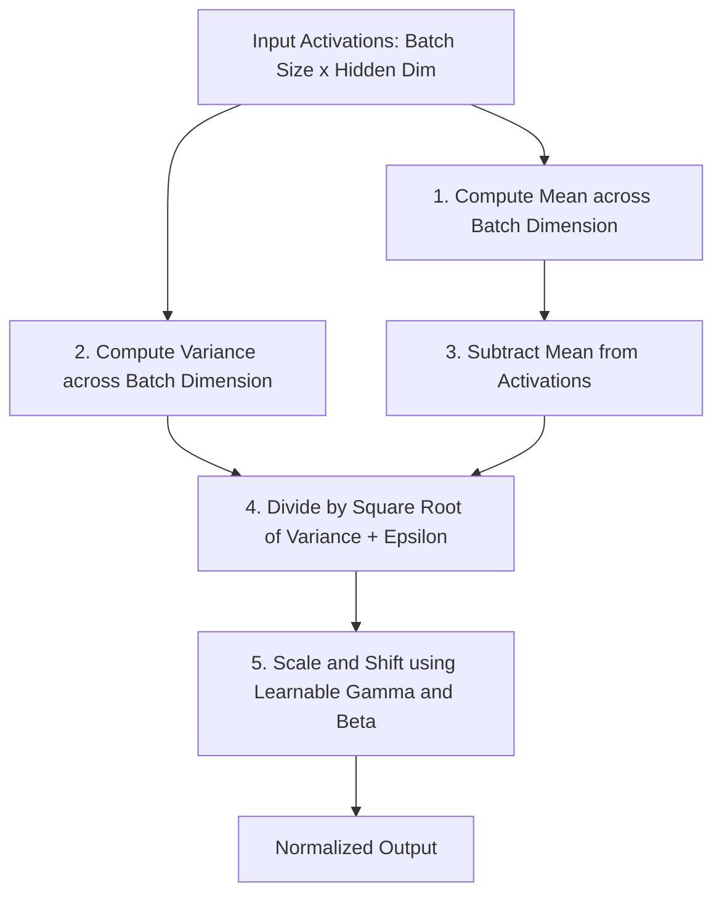

# Batch Normalization (BN)

Batch Normalization is a foundational regularization and normalization technique designed to accelerate and stabilize the training of deep neural networks. Introduced by Sergey Ioffe and Christian Szegedy in 2015, it addresses the problem of **Internal Covariate Shift**—the continuous change in the distribution of network activations during training.

---

## 1. Mathematical Formulation

For a given mini-batch $\mathcal{B} = \{x_1, \dots, x_m\}$, Batch Normalization normalizes the activation vector across the batch dimension:

1. **Mini-Batch Mean:**
   $$\mu_{\mathcal{B}} = \frac{1}{m} \sum_{i=1}^{m} x_i$$

2. **Mini-Batch Variance:**
   $$\sigma_{\mathcal{B}}^2 = \frac{1}{m} \sum_{i=1}^{m} (x_i - \mu_{\mathcal{B}})^2$$

3. **Normalize:**
   $$\hat{x}_i = \frac{x_i - \mu_{\mathcal{B}}}{\sqrt{\sigma_{\mathcal{B}}^2 + \epsilon}}$$

4. **Scale and Shift:**
   $$y_i = \gamma \hat{x}_i + \beta \equiv \text{BN}_{\gamma,\beta}(x_i)$$

Where:
- $m$ is the mini-batch size.
- $\epsilon$ is a small constant for numerical stability.
- $\gamma$ and $\beta$ are learnable parameters that allow the network to restore representation capacity if needed.

---

## 2. Structural Architecture Flow

In Batch Normalization, features are normalized across all samples in the current mini-batch:

---

## 3. Key Advantages & Limitations

### Advantages
*   **Faster Convergence:** Allows for significantly higher learning rates, which accelerates training.
*   **Regularization Effect:** Introduces mild noise due to batch-level statistics, reducing the need for Dropout.
*   **Gradient Flow Improvement:** Prevents gradients from vanishing or exploding by stabilizing activation distributions.

### Limitations
*   **Batch Size Dependency:** Performance degrades heavily when batch sizes are small (e.g., $m < 4$).
*   **RNN/Transformer Incompatibility:** Not suited for sequential models where sequence length varies, or where statistics must be computed per sample.
*   **Inference Overhead:** Requires maintaining running averages of mean and variance to use during evaluation.

---

[← Back to README](../README.md)
