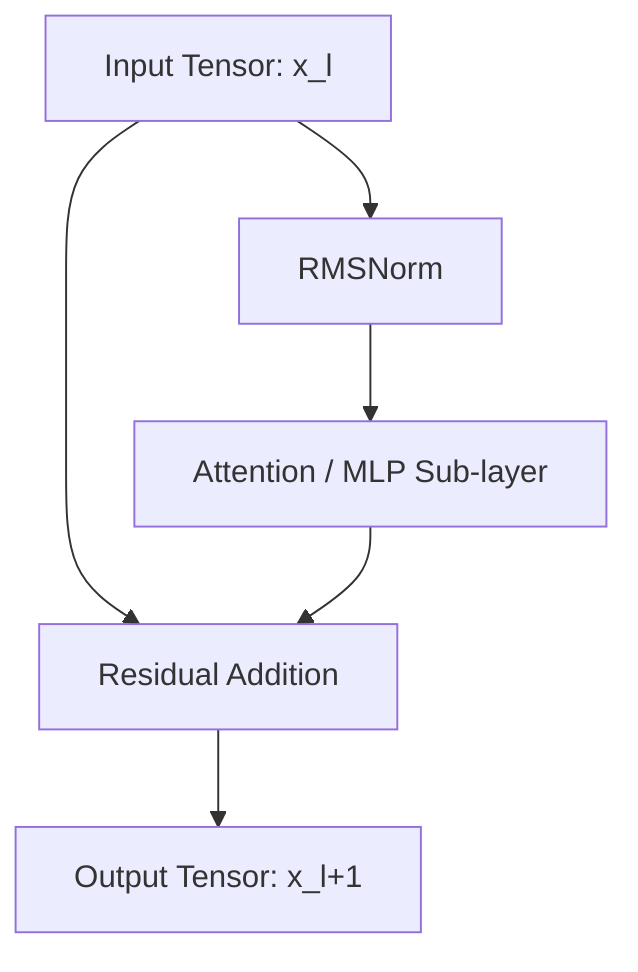

# The Deep-Layer Scale Drift Dilemma

Root Mean Square Normalization (RMSNorm) discards the mean-centering step to gain efficiency. While this is mathematically sound for individual layers, it introduces a subtle issue in very deep networks: **Scale and Mean Drift**.

---

## 1. The Core Issue: Lack of Mean Centering

Because RMSNorm only scales features to have a root mean square of $1$, it does not guarantee that the mean of the activations is $0$. As activations pass through dozens of residual blocks, the mean can gradually drift away from zero. 

This drift can cause:
*   **Activation Saturation:** Values shifting into flat regions of non-linear activation functions (like GeLU or SwiGLU).
*   **Representation Degradation:** Deep layers losing representation capacity due to skewed activation ranges.

---

## 2. Mitigation via Pre-LN Architecture

To counter scale drift, modern Large Language Models place the normalization block **before** the sub-layers (Self-Attention and MLP), rather than after them. This is known as the **Pre-Layer Normalization (Pre-LN)** configuration.

```
       Post-LN (Drift-Prone)                  Pre-LN (Stable)
    ┌───────────────────────┐            ┌───────────────────────┐
    │  Input ──> SubLayer  │            │  Input ───> RMSNorm   │
    │              │        │            │               │       │
    │              ▼        │            │               ▼       │
    │            Add        │            │           SubLayer    │
    │              │        │            │               │       │
    │              ▼        │            │               ▼       │
    │           RMSNorm     │            │              Add <──  │
    │              │        │            │               │       │
    │              ▼        │            │               ▼       │
    │            Output     │            │            Output     │
    └───────────────────────┘            └───────────────────────┘
```

---

## 3. Structural Block Flow

The Pre-LN block setup resets activation variances before processing, maintaining stable bounds across hundreds of layers:



---

[← Back to README](../README.md)
