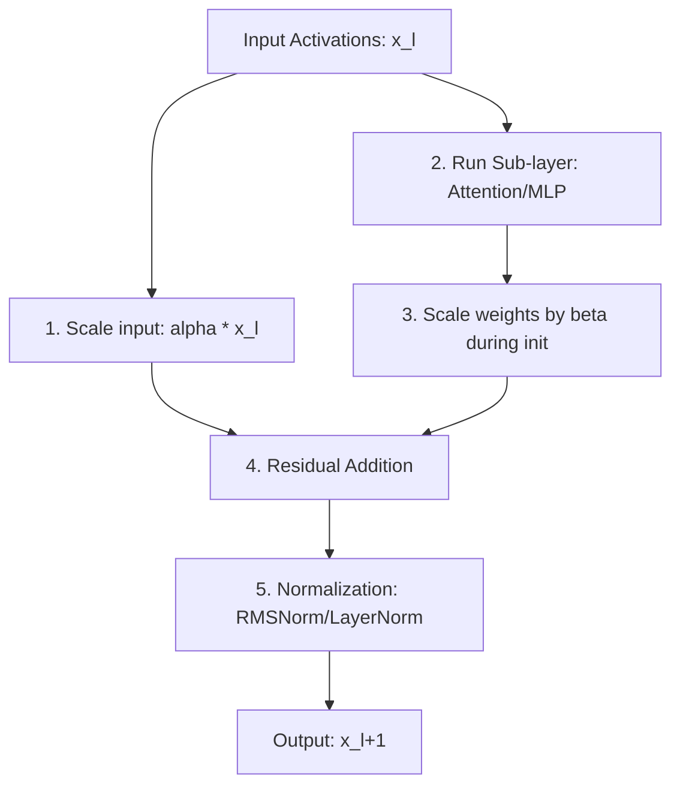

# DeepNorm & Stable Normalization Variants

DeepNorm is an advanced normalization and stabilization technique introduced by Microsoft Research in 2022 (*"DeepNet: Scaling Transformers to 1,000 Layers"*). It combines normalization scaling adjustments with custom weight initialization parameters to enable training of extremely deep neural network models without gradient explosions or training instability.

---

## 1. The Core Problem: Deep Transformer Scaling

As Transformer networks grow to 100+ layers, training stability degrades due to:
*   **Gradient Explosion/Vanishing:** Gradients grow exponentially or collapse through recursive backpropagation paths.
*   **Initialization Sensitivity:** Standard initialization methods (like Xavier or Kaiming) do not scale well with massive depth.

DeepNorm addresses this by scaling the residual connection and modifying weight initialization dynamically based on depth.

---

## 2. Mathematical Formulation & Architecture

DeepNorm modifies the standard residual connection block. Instead of $x_{l+1} = \text{LayerNorm}(x_l + \text{SubLayer}(x_l))$, DeepNorm executes:

$$x_{l+1} = \text{Norm}(\alpha \cdot x_l + \text{SubLayer}(x_l))$$

where:
*   $\alpha$ is a scaling factor less than $1$ (e.g., bounds the residual output).
*   The weight initialization of parameter matrices is scaled down by a factor $\beta$ (e.g., $\text{var}(W) \propto \beta^2$).

Both $\alpha$ and $\beta$ are defined as functions of the total number of layers $N$:

$$\alpha = (2N)^{-\frac{1}{4}}$$

$$\beta = (8N)^{-\frac{1}{4}}$$

---

## 3. Structural Flowchart

---

## 4. Key Takeaways
*   **Stability at Scale:** Proved successful in training a 1,000-layer Transformer.
*   **Initialization Co-dependency:** Highlights that normalization architectures must be designed in tandem with weight initialization strategies.

---

[← Back to README](../README.md)
