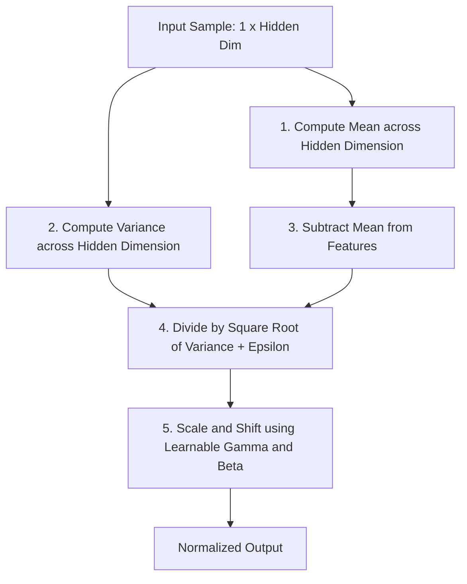

# Layer Normalization (LN)

Layer Normalization was introduced by Jimmy Lei Ba, Jamie Ryan Kiros, and Geoffrey E. Hinton in 2016. Unlike Batch Normalization, which normalizes activations across a batch, Layer Normalization operates directly on the feature/channel dimensions of a single sample. This makes it independent of batch size and highly suited for sequential models like Recurrent Neural Networks (RNNs) and Transformers.

---

## 1. Mathematical Formulation

For a layer with $H$ hidden units, the activations $x$ for a single training sample are normalized as follows:

1. **Layer Mean:**
   $$\mu = \frac{1}{H} \sum_{i=1}^{H} x_i$$

2. **Layer Variance:**
   $$\sigma^2 = \frac{1}{H} \sum_{i=1}^{H} (x_i - \mu)^2$$

3. **Normalize:**
   $$\hat{x}_i = \frac{x_i - \mu}{\sqrt{\sigma^2 + \epsilon}}$$

4. **Scale and Shift:**
   $$y_i = \gamma_i \hat{x}_i + \beta_i$$

Where:
- $H$ is the number of hidden channels/features.
- $\gamma$ and $\beta$ are learnable scaling and shifting vectors of size $H$.

---

## 2. Structural Architecture Flow

In Layer Normalization, normalization is done independently for each sample along the feature dimension:

---

## 3. Key Advantages & Limitations

### Advantages
*   **Batch Size Independence:** Works identically during training and inference, regardless of the mini-batch size.
*   **Sequential Model Friendly:** Can be applied to dynamic-length sequences (e.g., in RNNs and Transformers).
*   **Simple Inference:** Does not require tracking or compiling running averages.

### Limitations
*   **Memory Bandwidth Bottleneck:** Standard implementation requires two complete passes over the feature data (one to compute the mean, and a second to compute variance deviations), leading to memory latency on GPUs.
*   **Computational Complexity:** Higher arithmetic overhead compared to scale-only alternatives like RMSNorm.

---

[← Back to README](../README.md)
