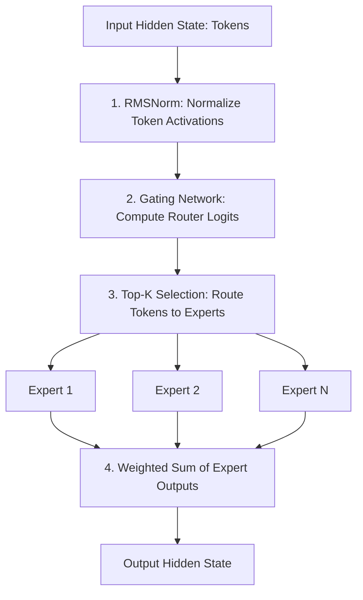

# Massive Mixture-of-Experts (MoE) Architecture Topologies

Mixture-of-Experts (MoE) architectures (like DeepSeek-V3 or Mixtral 8x7B) scale model parameters without a proportional increase in computing cost. Deployed within MoE networks, RMSNorm plays a critical role in stabilizing token parameter routing.

---

## 1. The Stability Challenge in MoE Routing

In sparse MoE models, a **gating (routing) network** decides which expert(s) should process a given token. 
*   **Routing Drift:** Because experts are selected dynamically, small variations or spikes in activation magnitudes can cause routing instability, leading to "expert collapse" (where a few experts receive all tokens, while others are under-utilized).
*   **Stabilizing Gating Inputs:** Applying RMSNorm to tokens immediately before they enter the gating network bounds input vectors. This ensures consistent logit ranges, leading to balanced and stable routing decisions.

---

## 2. MoE Layer Integration Flow

---

## 3. Real-world Impact
*   **DeepSeek-V3:** Utilizes RMSNorm to stabilize routing across dozens of active experts, keeping sparse training stable over trillions of tokens.
*   **Mixtral 8x7B:** Uses scale-only normalization to balance router logits, optimizing MoE dispatch overhead.

---

[← Back to README](../README.md)
