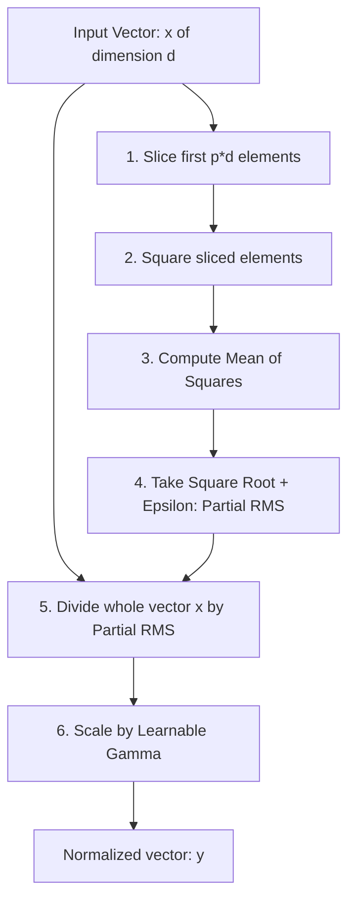

# Partial RMSNorm (pRMSNorm)

Partial RMSNorm (pRMSNorm) is an ultra-lightweight variant of Root Mean Square Layer Normalization (RMSNorm) proposed by Zhang and Sennrich in their 2019 paper. It is designed to optimize memory bandwidth and execution speed even further by computing the root mean square metric over only a subset of the hidden channel dimensions.

---

## 1. Mechanics of pRMSNorm

Rather than reading the entire vector $x$ of dimension $d$ to calculate the RMS, pRMSNorm selects a fixed fraction $p \in (0, 1]$ (typically $p = 6.25\%$ or $12.5\%$) of the channels. The RMS is calculated only on these $p \cdot d$ elements, and the resulting scale factor is applied to normalize the entire vector $x$.

$$\text{RMS}_p(x) = \sqrt{\frac{1}{\lfloor p \cdot d \rfloor} \sum_{i=1}^{\lfloor p \cdot d \rfloor} x_i^2 + \epsilon}$$

$$\text{pRMSNorm}(x) = \frac{x}{\text{RMS}_p(x)} \odot \gamma$$

---

## 2. Computational Flowchart

---

## 3. Advantages & Trade-offs

### Advantages
*   **Reduced Memory Bandwidth:** Reading fewer elements to calculate the scaling factor reduces memory bandwidth usage on hardware registers.
*   **High Performance:** Extremely effective in wide networks ($d_{model} \ge 8192$), where saving on memory reads translates directly to wall-clock speedups.

### Trade-offs
*   **Approximation Error:** If the sliced portion has a significantly different distribution than the rest of the vector, it may lead to unstable scaling, though empirical studies show negligible convergence impact.

---

[← Back to README](../README.md)
