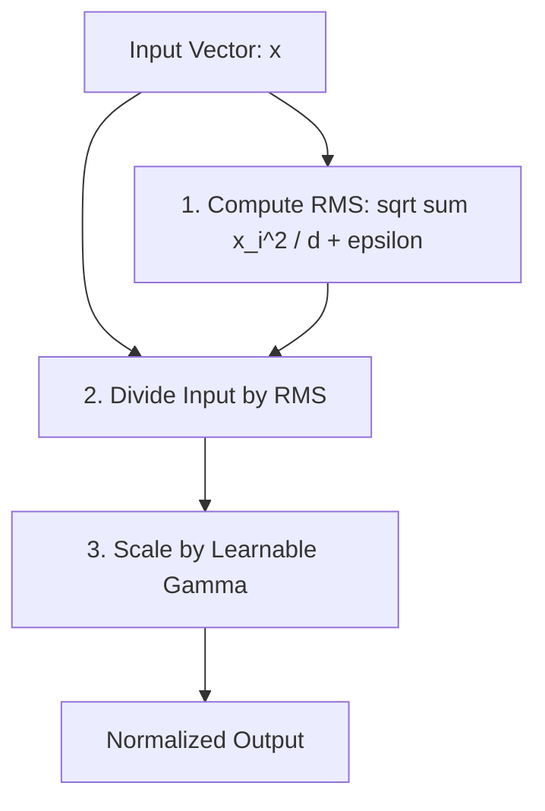

# The Scale-Only Layer Revolution (RMSNorm)

Root Mean Square Normalization (RMSNorm) was proposed by Biao Zhang and Rico Sennrich in 2019 as a computationally efficient alternative to Layer Normalization (LayerNorm). The core thesis of the scale-only revolution is that the **shift-invariance property** (centering data around a zero mean) in LayerNorm contributes negligibly to training stability, whereas the **scaling-invariance property** is the true driver of convergence.

---

## 1. The Core Paradigm Shift

Standard LayerNorm computes both the mean ($\mu$) and variance ($\sigma^2$) to normalize the inputs. By omitting the mean-centering step, RMSNorm simplifies the mathematical structure, scaling the activations purely by their Root Mean Square (RMS) value.

```
       LayerNorm (2-Pass)                  RMSNorm (1-Pass)
    ┌──────────────────────┐            ┌──────────────────────┐
    │  Compute Mean (μ)    │            │                      │
    │  Compute Var (σ²)    │            │  Compute RMS (Scale) │
    │  Normalize (x-μ)/σ   │            │  Normalize x/RMS     │
    │  Scale & Shift (γ,β) │            │  Scale only (γ)      │
    └──────────────────────┘            └──────────────────────┘
```

---

## 2. Structural Architecture Flow

RMSNorm processes the activations in a streamlined, single-pass pipeline:



---

## 3. Benefits of the Revolution

*   **Memory Efficiency:** Dropping the mean calculation avoids intermediate reads/writes to GPU High Bandwidth Memory, resolving memory latency issues.
*   **Reduced FLOPs:** Eliminates subtraction operations across all channels.
*   **Industry Standard:** Adopted as the default normalization technique in state-of-the-art LLMs (e.g., Llama, Mistral, Gemma, DeepSeek).

---

[← Back to README](../README.md)
