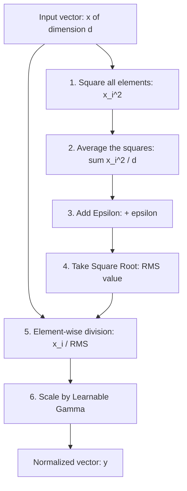

# Standard RMSNorm

Standard Root Mean Square Layer Normalization (RMSNorm) is a hardware-aware regularization and normalization method. It simplifies standard LayerNorm by keeping only the scaling properties and discarding the mean-centering step.

---

## 1. Mathematical Formulation

Given an input activation vector $x \in \mathbb{R}^d$, the standard RMSNorm is defined as:

$$\bar{x} = \frac{x}{\text{RMS}(x)} \odot \gamma$$

where the Root Mean Square statistic $\text{RMS}(x)$ is computed as:

$$\text{RMS}(x) = \sqrt{\frac{1}{d} \sum_{i=1}^{d} x_i^2 + \epsilon}$$

and:
- $d$ is the dimensionality of the hidden layer.
- $\epsilon$ is a small float (e.g., $1\text{e-}5$ or $1\text{e-}6$) to prevent division by zero.
- $\gamma \in \mathbb{R}^d$ is a learnable scaling parameter vector initialized to all ones.
- $\odot$ is the element-wise multiplication operator.

---

## 2. Computational Flowchart

The following flowchart illustrates the step-by-step calculation of standard RMSNorm:



---

## 3. PyTorch Implementation Reference

```python
import torch
import torch.nn as nn

class RMSNorm(nn.Module):
    def __init__(self, dim: int, eps: float = 1e-6):
        super().__init__()
        self.eps = eps
        self.weight = nn.Parameter(torch.ones(dim))

    def forward(self, x):
        variance = x.pow(2).mean(-1, keepdim=True)
        return x * torch.rsqrt(variance + self.eps) * self.weight
```

---

[← Back to README](../README.md)
